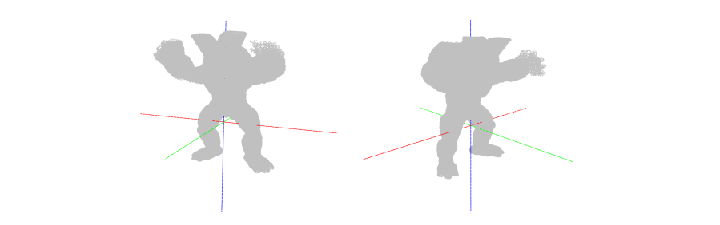

# Depth map to 3D Point Cloud Conversion
(Last Update : 25 Jul. 2021)  
Generating 3D point cloud from depth map with virtual camera's parameter.

## Requirement
- MacOS or Linux (Ubuntu recommended)
- Python 3 (Conda virtual environment recommended)
  - natsort
  - open3d (We use 0.13.0 version)

## Installation & Run

### Using Anaconda

- Setup the anaconda virtual environment and installing requirements
```
git clone https://github.com/kuai-lab/Event-based-3D-Reconstruction
conda create -n <env_name> python=3.8
conda activate <env_name>
pip install -r requirements.txt
```
### Run demo 
#### Option #1 (depth map from *.npz)
- You can input your data which composed with *.npz format, it may include **depth map**, intrinsic parameter and extrinsic parater per frames.
- Put your input data in ```depth2pc/data``` directory, run ```point_cloud_generator.py``` with direction below.
- Your point cloud data will be stored in ```depth2pc/output``` directory as *.ply format.
```
cd depth2pc
python point_cloud_generator_only_gt.py
```

#### Option #2 (depth map from *.npy)
- You can input your data which composed with *.npz format, it may include intrinsic parameter and extrinsic parater per frames.
- **Note that this option take depth map from another file which have \*.npy format.**
- Put your input *.npz data in ```depth2pc/data``` directory, and also set your directory for *.npy freely. Then. run ```point_cloud_generator.py``` with direction below.
- Your point cloud data will be stored in ```depth2pc/output``` directory as *.ply format.
```
cd depth2pc
python point_cloud_generator.py
```

  
### (Additional) Run in Notebook

- We also. provide this generator as notebook. You can show in [notebook](jupyter/point_cloud_generator.ipynb).
- You can check your camera position & orientation in [notebook](jupyter/camera_pose_visualization.ipynb).

  

## Delete Duplicated Coint Cloud (7.25 added)
We provide downsampling function as module, this contained in ```util/down_sampling.py```.
- This function is based on voxel-grid down-sampling.
- You can set your own parameter for sampling, ```voxel_size```.

  
## Output Example
- 2 views of demo output ```armadilo.ply```

